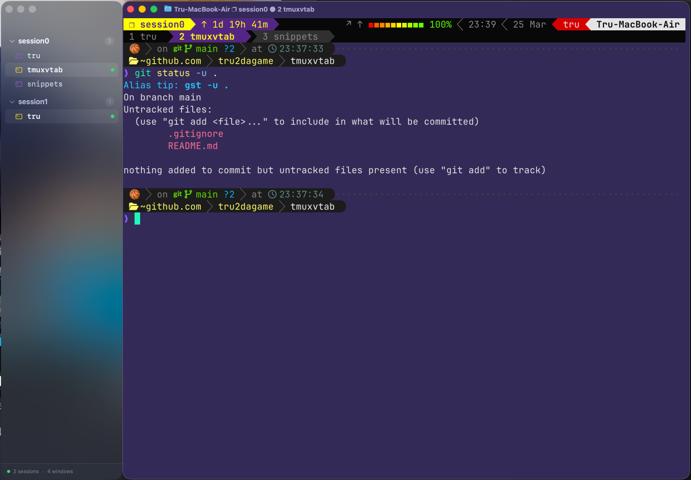

# TmuxVTab

A vertical tab bar for tmux, built as a lightweight macOS companion app for [Ghostty](https://ghostty.org).



## Features

- **Floating sidebar** that docks to Ghostty's left or right edge
- **Auto show/hide** -- appears when Ghostty launches, hides when it quits
- **Real-time tracking** -- follows Ghostty's window position every 300ms
- **Agent detection** -- identifies Claude Code, Codex, Aider, and Copilot via process tree walking
- **No dock icon, no menubar icon** -- pure background agent app
- **Tmux commands** -- control everything from tmux, no keybindings needed

## Install

### TPM (Tmux Plugin Manager)

Add to your `~/.tmux.conf` or `~/.tmux.conf.local`:

```bash
set -g @plugin 'tru2dagame/TmuxVTab'
```

Then press `prefix + I` to install. TmuxVTab will automatically download the pre-built binary from GitHub Releases and start.

### Manual

```bash
git clone https://github.com/tru2dagame/TmuxVTab.git ~/.tmux/plugins/TmuxVTab
~/.tmux/plugins/TmuxVTab/bin/tmuxvtab start
```

### Build from Source

Requires macOS 15+ and Swift 6.0+.

```bash
git clone https://github.com/tru2dagame/TmuxVTab.git
cd TmuxVTab
swift build -c release
bin/tmuxvtab start    # starts using locally built binary
```

## Usage

All commands are available as tmux command aliases (no keybindings needed):

| Command                    | Shell             | tmux command mode (`prefix :`) |
|----------------------------|-------------------|--------------------------------|
| **Toggle** (restart/start) | `tmux vtab`       | `vtab`                         |
| Start                      | `tmux vtab-start` | `vtab-start`                   |
| Stop                       | `tmux vtab-stop`  | `vtab-stop`                    |
| Dock left                  | `tmux vtab-left`  | `vtab-left`                    |
| Dock right                 | `tmux vtab-right` | `vtab-right`                   |
| Always on top              | `tmux vtab-pin`   | `vtab-pin`                     |
| Follow Ghostty focus       | `tmux vtab-unpin` | `vtab-unpin`                   |

Settings (`left`/`right`, `pin`/`unpin`) are persisted and take effect immediately without restarting.

Font size is adjustable via right-click context menu on the panel.

## Update

### TPM

```bash
# Press prefix + U to update all plugins, then restart:
tmux vtab
```

### Manual

```bash
cd ~/.tmux/plugins/TmuxVTab
git pull
rm -f .build/release/TmuxVTab    # remove old binary
tmux vtab                        # downloads new release binary and starts
```

## Requirements

- macOS 15 (Sequoia) or later
- [Ghostty](https://ghostty.org) terminal
- tmux

## How It Works

TmuxVTab is a native macOS app (AppKit + SwiftUI) that runs as a background agent:

1. Monitors Ghostty via `NSWorkspace` notifications and `CGWindowListCopyWindowInfo` polling
2. Polls tmux sessions/windows every 3 seconds via CLI
3. Detects coding agents by walking the process tree from each pane's PID
4. Renders a floating `NSPanel` that tracks Ghostty's window frame

## License

MIT
