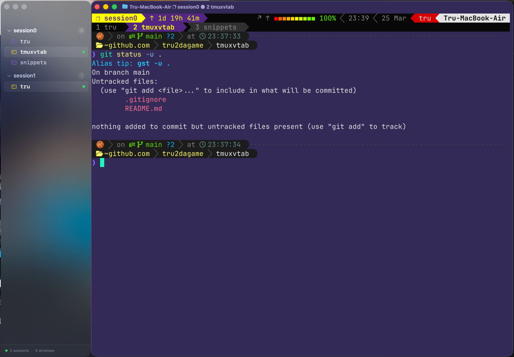

# TmuxVTab

A vertical tab bar for tmux, built as a lightweight macOS companion app for [Ghostty](https://ghostty.org).



## Features

- **Floating sidebar** that docks to Ghostty's left or right edge
- **Auto show/hide** -- appears when Ghostty launches, hides when it quits
- **Real-time tracking** -- follows Ghostty's window position every 300ms
- **Agent previews** -- shows Claude Code and Codex prompts, progress, approvals, and results
- **Fallback detection** -- identifies Claude Code, Codex, Aider, and Copilot via process tree walking
- **No dock icon, no menubar icon** -- pure background agent app
- **Tmux commands** -- control everything from tmux, no keybindings needed

## Install

### TPM (Tmux Plugin Manager)

Add to your `~/.tmux.conf` or `~/.tmux.conf.local`:

```bash
set -g @plugin 'tru2dagame/TmuxVTab'
```

Then press `prefix + I` to install. TmuxVTab will automatically download the pre-built binary from GitHub Releases and start.

### Manual

```bash
git clone https://github.com/tru2dagame/TmuxVTab.git ~/.tmux/plugins/TmuxVTab
~/.tmux/plugins/TmuxVTab/bin/tmuxvtab start
```

### Build from Source

Requires macOS 15+ and Swift 6.0+.

```bash
git clone https://github.com/tru2dagame/TmuxVTab.git
cd TmuxVTab
swift build -c release
bin/tmuxvtab start    # starts using locally built binary
```

## Optional: Live Claude Code and Codex previews

TmuxVTab includes its own local hook transport. Short-lived hooks normalize
Claude Code and Codex events and send bounded previews to the running app over
a user-private Unix socket. There is no token, pairing step, cloud service,
transcript scraping, or separately downloaded hook binary.

### Register the TmuxVTab Claude Code plugin

In any running Claude Code session:

```
/plugin marketplace add ~/.tmux/plugins/TmuxVTab
/plugin install tmuxvtab@tru2dagame
/reload-plugins
```

This registers the shared lifecycle hooks plus Claude-specific notification and
failure events.

### Register the TmuxVTab Codex plugin

```bash
codex plugin marketplace add ~/.tmux/plugins/TmuxVTab
codex plugin add tmuxvtab@tru2dagame
```

Start a new Codex session, run `/hooks`, and trust the reviewed TmuxVTab hook
definitions. Codex stores trust against the exact hook definition, so changed
hooks need to be reviewed again.

Verify it's working — send any prompt in a Claude pane, then:

```bash
ls -l "$HOME/Library/Application Support/TmuxVTab/agent-events.sock"
jq . "$HOME/Library/Application Support/TmuxVTab/agent-state.json"
```

The socket and state file are mode `0600`; their parent directory is mode
`0700`. Prompt and response previews are capped at 1,000 characters, other
display fields are capped more aggressively, and stale persisted pane state is
dropped after 24 hours. If TmuxVTab is not running, hooks fail open and do not
block either agent.

## Usage

All commands are available as tmux command aliases (no keybindings needed):

| Command                    | Shell             | tmux command mode (`prefix :`) |
|----------------------------|-------------------|--------------------------------|
| **Toggle** (restart/start) | `tmux vtab`       | `vtab`                         |
| Start                      | `tmux vtab-start` | `vtab-start`                   |
| Stop                       | `tmux vtab-stop`  | `vtab-stop`                    |
| Dock left                  | `tmux vtab-left`  | `vtab-left`                    |
| Dock right                 | `tmux vtab-right` | `vtab-right`                   |
| Always on top              | `tmux vtab-pin`   | `vtab-pin`                     |
| Follow Ghostty focus       | `tmux vtab-unpin` | `vtab-unpin`                   |

Settings (`left`/`right`, `pin`/`unpin`) are persisted and take effect immediately without restarting.

Font size is adjustable via right-click context menu on the panel.

## Update

### TPM

```bash
# Press prefix + U to update all plugins, then restart:
tmux vtab
```

### Manual

```bash
cd ~/.tmux/plugins/TmuxVTab
git pull
rm -f .build/release/TmuxVTab    # remove old binary
tmux vtab                        # downloads new release binary and starts
```

### Pre-release testing

Release candidates are opt-in and do not replace the latest stable release:

```bash
cd ~/.tmux/plugins/TmuxVTab
TMUXVTAB_RELEASE_TAG=v1.1.0-rc.1 bin/tmuxvtab download
bin/tmuxvtab restart
```

Omit `TMUXVTAB_RELEASE_TAG` to return to the latest stable release.

## Requirements

- macOS 15 (Sequoia) or later
- [Ghostty](https://ghostty.org) terminal
- tmux

## How It Works

TmuxVTab is a native macOS app (AppKit + SwiftUI) that runs as a background agent:

1. Monitors Ghostty via `NSWorkspace` notifications and `CGWindowListCopyWindowInfo` polling
2. Polls tmux sessions/windows every 3 seconds via CLI
3. Receives versioned Claude/Codex lifecycle events over a local Unix socket
4. Keeps a small per-pane state machine for questions, activity, approvals, and results
5. Falls back to process-tree agent detection when no hook state is available
6. Renders a floating `NSPanel` that tracks Ghostty's window frame

## Thanks

The local hook/daemon split was informed by the same general design used by
agent observability tools such as Moshi. TmuxVTab's implementation is
independent, local-only, and fully contained in this repository.

## License

MIT
